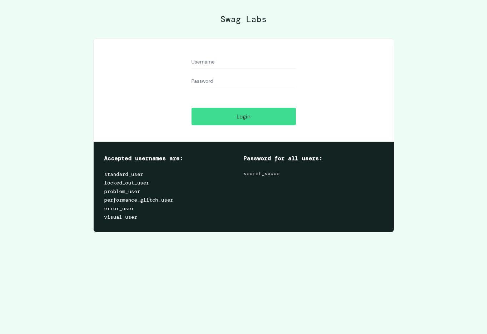

# Online Shop Manual Testing

A beginner QA portfolio project for [SauceDemo / Swag Labs](https://www.saucedemo.com/), focused on login, products, cart, checkout and logout.

**Project stage: test design prepared; execution in progress.**

| Measure | Current value |
| --- | ---: |
| Designed cases | 25 |
| Executed | 1 |
| Passed | 1 |
| Failed | 0 |
| Not run | 24 |
| Confirmed defects | 0 |

These figures describe the saved run only. A visible login page is not evidence that checkout or authentication works. No overall quality or release-readiness conclusion is available.

## Read the project

1. [Test plan and scope](docs/test-plan.md)
2. [Detailed test cases](test-cases/test-cases.md)
3. [Execution log](test-cases/execution-log.md)
4. [Current test summary](docs/test-summary.md)
5. [Evidence index](evidence/README.md)
6. [Defect register and reporting template](bug-reports/README.md)
7. [Step-by-step execution guide](docs/execution-guide.md)
8. [GitHub publishing guide](docs/github-guide.md)

## Methods demonstrated

Risk-based prioritisation, positive and negative cases, simple boundary checks, state transitions, arithmetic checks, evidence traceability and reproducible defect reporting. These describe the test design; completed execution is recorded separately.

## Attribution and limits

The project was prepared with ChatGPT assistance at the owner's request. The initial page check was executed by ChatGPT using browser interaction on 12 September 2026. The owner has not yet independently executed or reviewed the cases. This is an AI-assisted learning project, not evidence of employment, certification or production QA experience. It does not include a reusable automation suite.

Expected results beyond the observed login screen are explicit test-design assumptions, not claimed official business requirements. Verify the live UI and clarify uncertain requirements during execution. SauceDemo is a third-party practice application; this project does not own or maintain it.

## Baseline evidence

